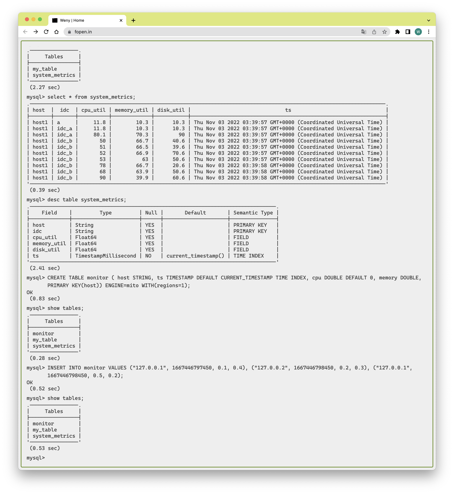
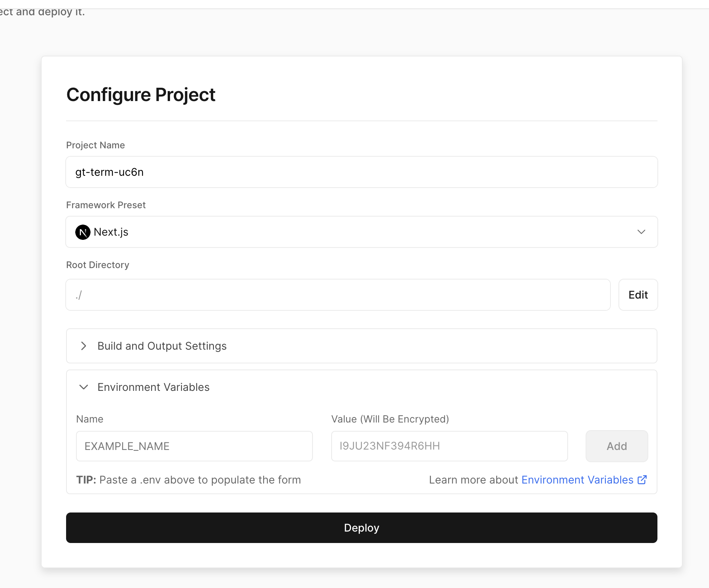

# GreptimeDB on vercel 🤣



## Before start
1. Setup a [GreptimeDB Cloud](https://console.greptime.cloud/) Account.
2. Create a free database instance,

## Deploy on vercel
1. Fork this project
2. Open [Vercel](https://vercel.com/), and Click `Add New Project`.
3. Select your forked Repo.
4. Fill `.env.example` and copy the file content into `Environment Variables` form.
   

5. Deploy!
## Local playground

1. cp `.env.example` `.env`.
2. Copy the connection info from [console](https://console.greptime.cloud/).
```
PGSQL_HOST=
PGSQL_PORT=4003
PGSQL_DATABASE=
PGSQL_USER=
PGSQL_PASSWORD=
```
4. Have fun! `yarn && yarn dev` .
